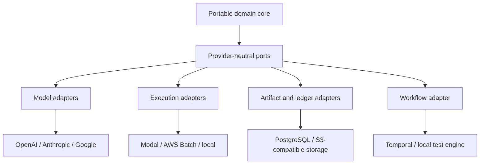
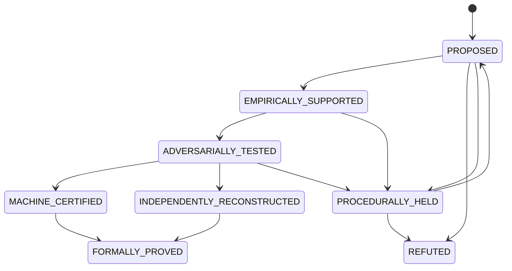

# AMRA Cloud System Specification

**Document ID:** AMRA-SYS-001  
**Version:** 0.1.0  
**Status:** Draft baseline  
**Program:** Exact Adaptive Multiscale Representation Atlas  
**Charter pricing snapshot:** 2026-07-31  
**Normative terms:** MUST, MUST NOT, SHOULD, SHOULD NOT, and MAY are used as requirement terms.

## 1. Purpose

This specification defines a vendor-neutral research operating system for exact adaptive representation research across SAT, constraint satisfaction, circuit complexity, proof complexity, and related formal domains.

AMRA searches exact, certificate-carrying paths

\[
R_0(I) \xrightarrow{\tau_1} R_1 \xrightarrow{\tau_2} \cdots \xrightarrow{\tau_k} R_k
\]

and records both constructive results and obstructions. Models may generate proposals, code, proof plans, and critiques. Promotion depends on deterministic evidence and explicit trust gates.

This document specifies the software system. It neither asserts a polynomial atlas navigator nor claims a separation result.

## 2. Goals and boundaries

### 2.1 Goals

The system MUST:

1. Make every research obligation durable, budgeted, resumable, and auditable.
2. Separate hypotheses, empirical evidence, machine certificates, reconstructions, and formal proofs.
3. Execute model work across replaceable providers without flattening provider-specific capabilities.
4. execute untrusted code and solver work in isolated, reproducible environments.
5. Preserve content-addressed artifacts and complete provenance.
6. Measure discovery and intermediate resources for every representation path.
7. Require adversarial independence before promotion-sensitive claims advance.
8. Support local development, a controlled pilot, and later horizontal scale through the same domain contracts.
9. Attribute model, search, sandbox, solver, storage, and orchestration cost to an obligation and claim.
10. Keep the durable intellectual means of production portable: definitions, datasets, transforms, certificates, manifests, proofs, and ledgers.

### 2.2 Explicit exclusions for v0.1

The baseline does not include:

- autonomous publication;
- autonomous changes to trust policy or theorem definitions;
- model training on private corpora;
- theorem promotion by model consensus;
- unrestricted network access from research sandboxes;
- a claim that restricted-atlas lower bounds extend to general circuit lower bounds;
- production operation at the full frontier-campaign scale.

## 3. Governing invariants

### 3.1 Epistemic authority

Evidence forms are ordered by explicit promotion rules rather than rhetorical confidence. A higher-cost model has no higher mathematical authority.

| Evidence object | What it establishes | What it cannot establish alone |
|---|---|---|
| Model proposal | A candidate statement, plan, or artifact | Truth, correctness, novelty |
| Test result | Behavior on the frozen tested domain | Universal validity |
| Reproduction | Reproducibility under a declared environment | General proof |
| SAT/SMT/proof certificate | A checker-accepted result under encoded semantics | Faithfulness of an incorrect encoding |
| Independent reconstruction | Independence of a proof route under a declared packet | Formal correctness |
| Lean theorem | Kernel acceptance of the formal statement | Equivalence to a stronger informal claim |
| Human promotion | Institutional acceptance of scope and interpretation | Replacement for machine evidence |

The system MUST store an informal claim, its formal statement, and their semantic delta separately.

### 3.2 Exactness

A transformation is exact only when its declared semantic relation is verified for its full stated domain. Each transform version MUST declare:

- source and target representation schemas;
- totality or explicit preconditions;
- semantic relation: equivalence, equisatisfiability, projection, reduction, or approximation;
- encoder and decoder behavior;
- certificate type and checker;
- resource-bound function;
- failure modes and unsupported inputs;
- canonicalization rules;
- implementation and specification versions.

Approximate transforms MAY be studied, but MUST occupy a distinct type and cannot enter an exact path without a theorem that restores the required semantics.

### 3.3 Complete resource accounting

Every path evaluation MUST account for applicable components of

\[
\Phi = (T_d,T_e,T_v,S,W,D,R,P,B,A,Q,C),
\]

where the coordinates denote discovery time, execution time, verification time, space, width, algebraic degree, rank, precision bits, advice, parallel work, communication, and monetary cost. Random bits, training compute, training data, preprocessing, and amortized state MUST be added when present.

The system MUST NOT classify a path as polynomial while excluding transform discovery, intermediate materialization, precision, advice, or aggregate parallel work.

### 3.4 Independence

Constructor and reviewer work MUST have distinct run identifiers and scratch spaces. Promotion-sensitive reviews SHOULD use a different provider family. Blind reconstruction packets MUST exclude constructor reasoning traces and undeclared lemmas. Shared public definitions and frozen computational artifacts are permitted and recorded.

### 3.5 Immutability and identity

Artifacts are identified by SHA-256 over canonical bytes. Published artifact records are append-only. Corrections create new versions and explicit supersession edges. Logical database deletion is reserved for legal or security requirements and MUST leave an auditable tombstone.

## 4. Architectural synthesis

“Vendor-neutral” and “deployable on named cloud services” are reconciled with a ports-and-adapters architecture:



The domain core contains obligations, claims, evidence, promotion policy, budgets, representation types, transforms, and resource measurements. It MUST import no provider SDK.

### 4.1 Required ports

| Port | Required operations |
|---|---|
| `ModelPort` | synchronous generation, batch submission, status, cancellation, usage receipt |
| `SearchPort` | query, fetch, snapshot, citation metadata |
| `SandboxPort` | create, execute, snapshot, export, terminate |
| `ComputePort` | submit, inspect, cancel, retrieve logs and outputs |
| `ArtifactPort` | put-if-absent, read, verify digest, retain, legal hold |
| `LedgerPort` | transactional commands, append events, consistent reads |
| `WorkflowPort` | start, signal, query, cancel, replay |
| `SecretPort` | scoped lease, rotation metadata, revocation |
| `CostPort` | reserve, debit, release, reconcile |
| `IdentityPort` | actor, role, service identity, signature verification |

Each adapter MUST pass the same conformance suite. Provider-specific capabilities are exposed as typed optional capabilities, never as untyped escape hatches.

## 5. Bounded contexts

### 5.1 Research graph

Owns representations, transforms, theorem dependencies, literature references, benchmark families, and open obligations.

### 5.2 Obligation execution

Owns task packets, workflow state, leases, attempts, budgets, approvals, and output validation.

### 5.3 Evidence and promotion

Owns claims, formal statements, evidence objects, reviews, reconstruction attempts, certificates, status transitions, and procedural holds.

### 5.4 Experimentation

Owns manifests, frozen inputs, environments, solver portfolios, random seeds, raw results, measurements, and reproductions.

### 5.5 Artifact provenance

Owns content-addressed objects, manifests, signatures, retention, lineage, and trust-level metadata.

### 5.6 FinOps and policy

Owns price books, reservations, receipts, quotas, alerts, provider health, routing rules, and cost attribution.

## 6. Canonical domain model

### 6.1 Primary entities

| Entity | Stable identity | Mutable fields |
|---|---|---|
| Program | UUID | charter version, state |
| Representation type | UUID + semantic version | metadata through new version only |
| Transform | UUID + semantic version | metadata through new version only |
| Claim | UUID | status, priority, owner, supersession |
| Formal statement | content digest | none |
| Obligation | UUID | lifecycle, budget, assignment |
| Attempt | UUID | state, receipts, timestamps |
| Artifact | SHA-256 | retention metadata only |
| Evidence | UUID | status; content immutable |
| Review | UUID | disposition; submitted content immutable |
| Experiment | UUID | state; frozen manifest immutable after start |
| Certificate | UUID + artifact digest | checker outcome |
| Promotion event | UUID | none |
| Cost event | UUID | reconciliation state |

### 6.2 Claim status state machine



Statuses describe accumulated evidence. They are not a single total order. `MACHINE_CERTIFIED` and `INDEPENDENTLY_RECONSTRUCTED` are independent dimensions stored as evidence predicates; the display state is a projection. `FORMALLY_PROVED` requires the formal statement to be explicit and the informal/formal delta reviewed.

### 6.3 Obligation lifecycle

Valid states are `DRAFT`, `READY`, `RESERVED`, `RUNNING`, `AWAITING_EVIDENCE`, `AWAITING_REVIEW`, `AWAITING_HUMAN`, `SUCCEEDED`, `FAILED`, `CANCELLED`, and `HELD`.

All transitions MUST be compare-and-set operations with an idempotency key. An attempt lease has a finite expiry and heartbeat. Workflow retries create or resume attempts according to activity semantics; they never duplicate irreversible promotion events.

## 7. Obligation packet

The normative JSON Schema is `schemas/obligation-packet.schema.json`. A packet MUST contain:

- a single objective and success predicate;
- dependency closure by stable identifier and digest;
- allowed tools and network policy;
- model and compute budgets;
- required output schema;
- promotion ceiling;
- independence constraints;
- immutable policy and definition versions;
- requested evidence and checker types.

The packet SHOULD remain compact. Whole-repository context requires a recorded exception.

## 8. Durable workflow specification

Temporal is the pilot `WorkflowPort` adapter. Workflow code MUST remain deterministic under replay. Network access, clocks, randomness, model calls, database writes, and object-store operations MUST occur in idempotent activities.

### 8.1 `ResearchCycleWorkflow`

Input: cycle ID, target claim or transform, policy version, aggregate budget, deadline.

Steps:

1. `ConstructObligationActivity`
   - resolve dependencies;
   - freeze definitions and the initial claim;
   - reserve budget;
   - write the obligation packet.
2. Launch child workflows with distinct scopes:
   - `ConstructiveTheoryWorkflow`;
   - `AdversarialTheoryWorkflow`;
   - `LiteratureVerificationWorkflow`;
   - `ExperimentDesignWorkflow`;
   - `FormalSpecificationWorkflow`.
3. `SynthesizeCandidateActivity` validates structured outputs and creates candidate evidence.
4. `ImplementationWorkflow` creates patches, images, manifests, and certificates.
5. `DeterministicCampaignWorkflow` executes tests, solvers, checkers, and resource instrumentation.
6. `AdversarialEscalationWorkflow` generates and minimizes high-peak-cost instances.
7. `BlindReconstructionWorkflow` builds a redacted packet and dispatches an independent attempt.
8. `PromotionWorkflow` evaluates gates and pauses for required human review.
9. `CycleSynthesisActivity` updates ledgers and proposes follow-on obligations.
10. `ReconcileCostActivity` closes reservations against provider receipts.

### 8.2 Signals and queries

Required signals:

- `cancel(reason, actor)`;
- `hold(reason, actor)`;
- `resume(actor)`;
- `approve_gate(gate_id, actor, decision_digest)`;
- `adjust_budget(delta, reason, actor)`;
- `supply_artifact(role, digest, actor)`.

Required queries:

- current state and blocked gate;
- reserved, spent, and forecast cost;
- child-workflow status;
- evidence and artifact digests;
- retry and lease state;
- next authorized actions.

### 8.3 Activity semantics

Every activity MUST declare one of:

- pure and safely replayable;
- idempotent by key;
- at-most-once with reconciliation;
- compensatable with an explicit compensating activity.

Provider request IDs, Batch job IDs, sandbox IDs, and artifact digests MUST be stored before polling. Heartbeats include resumable cursor state. Cancellation MUST propagate to model batches, sandboxes, and compute jobs where the provider supports it.

### 8.4 Deterministic workflow testing

CI MUST run replay tests against recorded workflow histories and property tests over transition order, retry timing, duplicate signals, cancellation, and budget exhaustion.

## 9. Model gateway and routing

### 9.1 Normalized request

A model request includes:

- obligation and attempt IDs;
- role and task class;
- provider-independent message content;
- typed tool definitions;
- output JSON Schema;
- context artifact digests;
- sensitivity classification;
- maximum input, output, wall time, calls, and cost;
- cache eligibility and stable-prefix digest;
- independence exclusions;
- required provider capabilities;
- seed or sampling controls when supported.

The gateway MUST return both normalized output and the untouched provider receipt/metadata as an immutable artifact.

### 9.2 Routing sequence

1. Ask the deterministic capability registry whether a parser, query, solver, checker, or static analyzer can answer the request.
2. Reject requests exceeding the obligation envelope.
3. Filter providers by data policy, capability, context length, health, and independence constraints.
4. Choose the least-cost eligible tier whose historical quality clears the task threshold.
5. Reserve worst-case cost before dispatch.
6. Validate output against schema and tool policy.
7. Debit actual usage; release unused reservation.
8. Escalate only on a typed failure or evidence-backed quality rule.

The concrete baseline is in `config/model-routing.yaml`. Model identifiers and prices are configuration data with effective dates. They MUST NOT be compiled into domain logic.

### 9.3 Escalation

Tier escalation requires a reason code: `CAPABILITY_REQUIRED`, `CONTEXT_REQUIRED`, `VALIDATION_FAILURE`, `REPEATED_COUNTEREXAMPLE`, `PROMOTION_REVIEW`, or `HUMAN_OVERRIDE`. Tier 4 additionally requires a written hypothesis about the expected value of the call and an obligation-level call budget.

### 9.4 Independence controls

The router MUST enforce:

- disallowed provider families and model lineages per attempt;
- constructor/reviewer separation;
- redacted reconstruction contexts;
- unique scratch namespaces;
- no cache reuse across a blind boundary unless the shared prefix is explicitly approved;
- disclosure of unavoidable shared artifacts.

Provider diversity reduces correlated error; deterministic and formal evidence remains the authority.

### 9.5 Data governance

Each provider adapter MUST declare retention, training-use, geographic, encryption, and logging properties. Requests containing restricted data are routed only to allowed providers. Prompt and response logging stores content digests by default; content storage follows the program data-classification policy.

## 10. Execution plane

### 10.1 Sandbox contract

Each sandbox is created from an immutable OCI image digest and receives:

- a read-only dependency packet;
- a writable ephemeral workspace;
- a scoped artifact upload credential;
- CPU, memory, disk, process, and wall-time limits;
- default-deny egress with explicit domain allowlists;
- no cloud instance credentials;
- a non-root user and hardened runtime profile.

On completion it emits a signed execution manifest, logs, outputs, environment inventory, and a patch or result bundle. Termination revokes leases and destroys writable state after export.

Modal is the pilot interactive adapter. A local container adapter MUST support development and conformance tests.

### 10.2 Deterministic compute contract

AWS Batch is the pilot batch adapter. Queue classes:

| Queue | Workload | Default capacity | Retry policy |
|---|---|---:|---|
| `certificate-critical` | LRAT/DRAT, proof and semantic checkers | reserved/on-demand | retry infrastructure failure only |
| `formalization` | Lean builds and theorem checks | mixed | retry infrastructure failure only |
| `solver-standard` | SAT/SMT portfolios, enumeration | Spot-first | bounded retry on interruption |
| `algebra-memory` | Gröbner and symbolic jobs | memory-optimized | checkpoint-aware |
| `tensor-accelerated` | contraction experiments | accelerator as required | checkpoint-aware |
| `adversarial-bulk` | mutations and small-instance search | Spot-only | interruption tolerant |

Job definitions MUST use immutable image digests, read-only roots where possible, explicit resources, digest-pinned inputs, network policy, and result-upload roles. A certificate-critical checker MUST use an independent image from its generator where practical.

### 10.3 Reproducibility levels

| Level | Requirement |
|---|---|
| R0 | Raw output exists |
| R1 | Command, inputs, and seed recorded |
| R2 | Dependency lock and OCI digest recorded |
| R3 | Independent rerun matches declared equivalence |
| R4 | Certificate or formal proof validates in a pinned trusted checker |

Promoted computational claims require at least R3. Machine-certified claims require R4.

## 11. Artifact and provenance system

### 11.1 Storage

The `ArtifactPort` uses an S3-compatible pilot adapter. Production buckets MUST enable versioning, encryption, access logging, lifecycle rules, and Object Lock for promoted evidence. Old bulk experiment data MAY transition to archival tiers when manifests and retrieval procedures remain intact.

### 11.2 Canonical manifest

Every execution manifest records:

- manifest schema version;
- obligation, attempt, claim, and experiment IDs;
- Git repository, commit, patch digest, and dirty-state declaration;
- source, dependency, and input artifact digests;
- OCI image and package-lock digests;
- command and normalized environment;
- tool and checker versions;
- random seeds and nondeterminism declaration;
- start/end timestamps and resource usage;
- output, log, certificate, and receipt digests;
- actor/service identity and signature;
- parent manifest for reproduction or derivation.

Canonical JSON uses UTF-8, sorted keys, normalized numbers, and no insignificant whitespace before hashing.

### 11.3 Supply-chain integrity

Builds SHOULD emit SBOMs and provenance attestations. Promoted images and release artifacts MUST be signed. CI verifies signatures, locked dependencies, and image vulnerability policy before deployment.

## 12. PostgreSQL theorem and experiment ledger

The initial schema is `db/migrations/001_initial.sql`.

### 12.1 Transaction boundaries

PostgreSQL is authoritative for domain state, identities, relationships, reservations, and promotion events. Object storage is authoritative for artifact bytes. The database stores artifact digests and URIs.

Artifact publication uses this sequence:

1. upload with put-if-absent under the content digest;
2. verify digest and durability response;
3. transact the artifact record and domain reference;
4. append an outbox event;
5. asynchronously index or replicate.

The outbox pattern MUST be used for workflow and event-bus notifications. Consumers are idempotent.

### 12.2 Ledger constraints

The database MUST enforce:

- unique immutable artifact digest;
- versioned transform identity;
- finite nonnegative budgets;
- promotion events referencing policy and evidence;
- no formal promotion without a formal statement;
- no evidence record without immutable content or artifact digest;
- no attempt outside its obligation;
- append-only promotion and cost event tables for ordinary service roles.

### 12.3 Retrieval

Semantic retrieval is advisory. pgvector indices MAY support discovery, while claim dependencies, citations, promotion gates, and certificate relationships MUST use exact relational edges.

## 13. Certificate and formal-proof pipeline

### 13.1 Certificate registry

Certificate types are registered with:

- MIME type and schema version;
- generator compatibility;
- checker image digest;
- checker command;
- soundness scope;
- resource limits;
- expected output schema;
- independent test corpus;
- trust tier and owner.

Candidate initial types include LRAT/DRAT proof objects, SAT models, SMT proofs where supported, transformation witness maps, symbolic identities, exhaustive-enumeration manifests, and Lean artifacts.

### 13.2 Verification separation

Generation and checking SHOULD occur in separate jobs and images. A checker failure never becomes a model repair prompt automatically without first recording the original failure artifact. Repaired certificates create a new version.

### 13.3 Lean promotion

Lean projects MUST pin Lean, Mathlib, lake manifests, and build images. `sorry`, untrusted axioms, and trust-expanding options are blocked in promoted directories unless an explicit policy exception is recorded. CI prints and reviews axiom dependencies for promoted theorems.

Formal promotion requires:

1. kernel-accepted build;
2. explicit formal statement digest;
3. informal-to-formal delta review;
4. dependency and axiom report;
5. independent clean-room build;
6. human sign-off for publication-grade claims.

## 14. Transform registry and atlas navigator

### 14.1 Transform interface

```text
inspect(input) -> Preconditions
estimate(input, resource_policy) -> ResourceEstimate
apply(input, parameters) -> Output + Witness + Measurements
check(input, output, witness) -> CheckResult
decode(output_solution, witness) -> InputSolution
```

`estimate` is advisory. Actual measurements and asymptotic proof obligations remain separate. `check` MUST be deterministic for an exact transform unless its certificate protocol explicitly includes verifiable randomness.

### 14.2 Path identity

A path is identified by the ordered transform-version sequence, parameter digests, initial representation digest, policy version, and environment digest. Equivalent-looking paths remain distinct until a canonical equivalence is proved.

### 14.3 Navigator policy

Learned policies MAY propose the next transform. They do not alter the registry or declare a terminal class. The evaluator computes exact eligibility and measured resources. Hidden benchmark families are isolated from policy training and prompt context.

### 14.4 Minimax campaigns

Navigator and adversarial instance-generator populations use disjoint dataset partitions and budgets. Fitness records the full peak resource vector rather than one scalar by default. Any scalarization MUST retain its weights, units, normalization, and Pareto alternatives.

## 15. API surface

The first control API SHOULD expose:

| Method | Path | Purpose |
|---|---|---|
| `POST` | `/v1/obligations` | Create a draft obligation |
| `POST` | `/v1/obligations/{id}:freeze` | Freeze packet and reserve budget |
| `POST` | `/v1/obligations/{id}:start` | Start durable workflow |
| `POST` | `/v1/obligations/{id}:cancel` | Cancel with reason |
| `POST` | `/v1/obligations/{id}:hold` | Place procedural hold |
| `GET` | `/v1/obligations/{id}` | State, gates, evidence, and spend |
| `POST` | `/v1/claims` | Register an informal claim |
| `POST` | `/v1/claims/{id}/formal-statements` | Link a versioned formal statement |
| `POST` | `/v1/claims/{id}/evidence` | Attach validated evidence |
| `POST` | `/v1/claims/{id}:promote` | Request policy evaluation |
| `POST` | `/v1/artifacts:initiate` | Begin digest-addressed upload |
| `POST` | `/v1/artifacts:finalize` | Verify and register upload |
| `GET` | `/v1/costs` | Aggregate attribution and forecasts |

Mutation calls require idempotency keys. Responses include object version, policy version, and trace ID. Generated OpenAPI and client libraries MUST be derived from one schema source.

## 16. Identity, security, and threat model

### 16.1 Roles

Minimum roles are `research-reader`, `research-agent`, `reviewer`, `formalizer`, `promoter`, `budget-controller`, `platform-operator`, and `auditor`. Agents receive short-lived workload identities. Human access uses SSO and phishing-resistant MFA where available.

### 16.2 Threats and controls

| Threat | Primary controls |
|---|---|
| Prompt injection in papers or repositories | untrusted-content labels, tool policy, schema validation, least privilege |
| Malicious generated code | isolated execution, default-deny egress, non-root runtime, resource limits |
| Certificate/checker coupling | separate images, independent checker corpus, signed registry |
| Artifact substitution | content addressing, signatures, Object Lock, manifest linkage |
| Budget exhaustion | preauthorization, hard envelopes, rate limits, kill signals |
| Model-provider leakage | data classification, provider policy filter, redacted logging |
| Workflow duplication | idempotency keys, leases, provider request IDs, reconciliation |
| Supply-chain compromise | locked dependencies, SBOM, attestations, signed images |
| Privilege escalation by agent | scoped credentials, no ambient cloud role, audited approvals |
| Epistemic laundering | typed evidence, status gates, claim/formal delta, immutable failures |

Secrets MUST remain outside prompts, source control, logs, artifacts, and environment snapshots. Secret values use leases and are redacted before persistence.

## 17. Observability and cost accounting

### 17.1 Telemetry

The platform MUST emit OpenTelemetry-compatible traces, metrics, and structured logs. Correlation fields include program, cycle, obligation, attempt, workflow, provider request, compute job, artifact, claim, and trace IDs.

### 17.2 Required metrics

Operational:

- workflow latency, replay failures, retries, stuck leases;
- queue depth, job interruption, sandbox startup and failure;
- checker pass/fail by version;
- artifact upload and digest failures;
- provider error, throttle, latency, and schema failure.

Epistemic:

- counterexamples per hypothesis;
- independent reconstructions per submitted claim;
- formal closures per submitted theorem;
- compound-path improvement over frozen single-transform baselines;
- hidden-family generalization;
- informal/formal delta severity.

Economic:

- spend and committed spend by claim, cycle, provider, tier, and evidence class;
- frontier-model dollars per restricted theorem;
- compute dollars per certified result;
- forecast versus envelope;
- duplicate-work ratio.

The charter's theorem-per-dollar measure is retained as one metric, with two safeguards: trivial theorem count cannot dominate value, and negative results receive explicit value through counterexample and eliminated-hypothesis metrics.

### 17.3 SLOs for pilot

- 99.5% monthly control-API availability, excluding announced maintenance;
- 99.9% artifact durability target backed by provider guarantees and integrity audits;
- 99% of durable workflows recover after a worker restart without manual state repair;
- 100% of promoted claims have complete provenance and policy references;
- 100% of provider charges reconciled to an obligation or quarantine account within 24 hours;
- recovery-point objective of 15 minutes for ledger state and recovery-time objective of 4 hours.

## 18. Budget enforcement and alarms

The machine-readable baseline is `config/budgets.yaml`.

Enforcement levels:

1. **Reservation:** worst-case cost fits remaining obligation and program envelopes.
2. **Dispatch:** provider and tier quotas fit current windows.
3. **Runtime:** sandboxes and jobs receive hard time and resource limits.
4. **Reconciliation:** receipts update actual and forecast spend.
5. **Alarm:** 50%, 75%, 90%, and 100% thresholds produce increasing actions.

At 90%, new Tier 3 and Tier 4 dispatch pauses without budget-controller approval. At 100%, new billable dispatch stops and cancellable work is evaluated under the configured shutdown policy. Certificate checking already required to establish the state of completed work remains eligible under a small protected verification reserve.

Budgets MUST exist at program-month, research-cycle, obligation, provider, model tier, execution backend, and search dimensions. Price books have effective intervals; reports retain the price version used at reservation and the final provider receipt.

## 19. Infrastructure as code

Terraform/OpenTofu modules MUST expose narrow interfaces and must not embed domain workflow logic.

### 19.1 Required modules

| Module | Provisions | Key outputs |
|---|---|---|
| `network` | VPC, subnets, endpoints, egress controls | subnet and security-group IDs |
| `identity` | workload roles, OIDC trust, KMS policies | role and key identifiers |
| `ledger` | PostgreSQL, backups, parameter and monitoring policy | writer/reader endpoints |
| `artifacts` | buckets, versioning, Object Lock, lifecycle | bucket and key identifiers |
| `batch` | compute environments, queues, job roles | queue and definition ARNs |
| `workflow` | Temporal namespace/configuration or self-host adapter inputs | namespace and endpoints |
| `observability` | collectors, dashboards, alerts, archival | ingest endpoints |
| `budgeting` | provider budgets, anomaly detection, notifications | alarm identifiers |
| `github-oidc` | CI trust and scoped deployment roles | role identifiers |
| `secrets` | secret containers and rotation hooks | secret identifiers only |

Each module MUST support tags for environment, owner, program, data class, and cost center. Production state uses encrypted remote storage, locking, versioning, and separate credentials. Plans run in pull requests; applies require protected-environment approval.

### 19.2 Deployment profiles

| Profile | Purpose | Characteristics |
|---|---|---|
| `local` | development and conformance | containers, local workflow test engine, MinIO-compatible storage, PostgreSQL |
| `pilot` | three-month active program | single region, managed PostgreSQL, multi-AZ only where justified, AWS Batch, Modal, Temporal Cloud |
| `laboratory` | scaled service | HA ledger, replicated artifacts, larger quotas, dedicated support |

The pilot profile is a replaceable composition of adapters, not the definition of AMRA.

## 20. GitHub controls and repository topology

Recommended top-level structure:

```text
apps/                 control API and operator interfaces
packages/domain/      portable domain core
packages/contracts/   schemas and generated clients
adapters/             provider implementations
workflows/            durable workflow definitions
transforms/           versioned transform modules
checkers/             certificate checkers
formal/               Lean projects
infra/                IaC modules and environments
config/               versioned policy
db/migrations/        append-only migrations
benchmarks/           generators and public fixtures
docs/                 specifications and ADRs
```

Required branch protections once implementation begins:

- pull requests and linear history for protected branches;
- two approvals for trust-policy, checker, formal, and production-IaC paths;
- CODEOWNERS for `checkers/`, `formal/`, `config/promotion/`, and `infra/environments/production/`;
- required signed provenance check, unit tests, schema compatibility, migration lint, workflow replay, secret scan, dependency scan, IaC policy, and cost estimate;
- dismissal of stale approvals after relevant changes;
- deployment environments with separate human approval;
- release tags signed and linked to image/artifact digests.

Agents work on bounded branches. Generated patches MUST disclose the obligation and attempt IDs in PR metadata. An agent cannot approve its own patch or resolve a promotion gate created by its output.

## 21. CI/CD gates

### 21.1 Pull-request checks

1. format, lint, typecheck, and unit tests;
2. JSON Schema and configuration validation;
3. database migration forward test and schema invariants;
4. workflow replay and idempotency tests;
5. adapter conformance tests with recorded fixtures;
6. sandbox escape and egress-policy tests;
7. certificate checker positive, negative, malformed, and resource-exhaustion corpus;
8. Lean clean build, axiom report, and prohibited-placeholder scan;
9. secret, license, dependency, image, and IaC scans;
10. Terraform/OpenTofu plan plus monthly cost delta.

### 21.2 Release flow

A release is built once, signed, promoted by digest, and deployed through environments. Rollback selects a prior signed digest. Database migrations require a tested forward recovery path; destructive migrations use expand/migrate/contract across releases.

## 22. Verification strategy

### 22.1 Software correctness

- property-based state-machine tests;
- fault injection at every external activity boundary;
- duplicate and reordered event tests;
- replay against production-like workflow histories;
- adapter contract tests;
- golden provenance manifests;
- cost-reconciliation simulations;
- chaos tests for Spot interruption, provider throttle, worker loss, and partial artifact upload.

### 22.2 Scientific integrity

- metamorphic tests for transformation semantics;
- exhaustive small-instance comparison against source semantics;
- independent certificate checker implementations for critical formats where practical;
- hidden benchmark families;
- counterexample minimization;
- proof reconstruction with redacted packets;
- explicit quantifier and asymptotic-bound audits;
- formal/informal statement-delta review.

### 22.3 Acceptance tests for v0.1 platform

The pilot is technically ready only when it can demonstrate:

1. A SAT instance enters as a content-addressed artifact and completes a solver plus independently checked certificate path.
2. A failed certificate remains immutable while a repaired version is linked as superseding evidence.
3. A workflow survives worker termination, retries idempotently, and preserves one promotion event.
4. A model constructor and different-family reviewer receive policy-compliant contexts with independent scratch state.
5. An obligation stops at budget exhaustion and all charges reconcile.
6. One transform passes exhaustive small-instance semantic checks and records all resource coordinates.
7. One claim proceeds through blind reconstruction and a pinned Lean build, with a reviewed statement delta.
8. A clean environment reproduces a promoted computational result from its manifest.
9. Provider replacement passes the adapter conformance suite without a domain-schema migration.
10. Dashboards trace a promoted result from claim to cost receipt and immutable artifacts.

## 23. Delivery plan

### Phase 0 — specification closure

- review vocabulary and trust boundaries;
- freeze v0.1 schemas;
- create architecture decision records;
- select licenses and public/private data boundaries;
- validate the charter price book separately from domain code.

Exit: specification review accepted and unresolved questions assigned.

### Phase 1 — vertical slice

- ledger, artifact store, local workflow adapter;
- one model adapter;
- local sandbox and one Batch-compatible compute adapter;
- SAT model and UNSAT certificate checking;
- cost reservation and reconciliation;
- end-to-end provenance UI or CLI.

Exit: acceptance tests 1–5 and 8 pass.

### Phase 2 — atlas foundation

- representation and transform registries;
- first exact transform with witness checker;
- full resource-vector instrumentation;
- benchmark generator registry;
- adversarial mutation/minimization.

Exit: acceptance test 6 passes and compound-path baseline protocol is frozen.

### Phase 3 — epistemic pipeline

- provider-diverse review;
- blind reconstruction;
- Lean project and promotion workflow;
- claim/formal delta reviews;
- hidden benchmark partitions.

Exit: acceptance test 7 passes.

### Phase 4 — three-month pilot

- deploy pilot infrastructure;
- operate under `config/budgets.yaml`;
- measure promotion yield, negative-result value, duplication, and human absorption;
- decide scale, hold, or redesign at the three-month gate.

## 24. Scaling gates

Spending and concurrency MAY increase only when all applicable gates hold:

- **Operational integrity:** complete provenance, recovery, reconciliation, and independent certificate checks.
- **Epistemic productivity:** repeated counterexamples, stronger surviving conjectures, reconstruction, and formal closure.
- **Parallel efficiency:** distinct validated work rises with concurrency while duplication remains below the declared threshold.
- **Benchmark generalization:** policies reproduce on hidden generator families.
- **Human absorption:** responsible humans understand promoted results and trust-boundary changes.

Throughput is subordinate to validated knowledge. A backlog of unread promoted artifacts automatically lowers frontier dispatch quotas.

## 25. Required architectural decisions before production

The following decisions remain open and MUST become ADRs:

1. License for code, datasets, proofs, and benchmark instances.
2. Managed versus self-hosted Temporal contingency and exit procedure.
3. PostgreSQL HA level for the pilot and restore-test cadence.
4. Artifact retention classes, Object Lock periods, and legal deletion process.
5. First supported SAT proof formats and checker implementations.
6. Lean trust policy, Mathlib strategy, and public theorem namespace.
7. Provider data classifications and allowed research corpora.
8. Scalar versus Pareto treatment of multiresource path cost.
9. Novelty and publication review process.
10. Public disclosure rules for negative results, prompt traces, and security-sensitive artifacts.

## 26. Charter-to-system traceability

| Charter requirement | System realization |
|---|---|
| Durable workflow state | `ResearchCycleWorkflow`, lifecycle and replay rules |
| Multi-provider diversity | `ModelPort`, routing and independence policies |
| Modal sandboxes | `SandboxPort` pilot adapter |
| AWS Batch solver/Lean farm | typed queues under `ComputePort` |
| PostgreSQL theorem ledger | canonical schema and transaction rules |
| Immutable S3 artifacts | content addressing, versioning, Object Lock |
| Typed skills | obligation packet plus required output schemas |
| Promotion statuses | claim evidence predicates and promotion state projection |
| Hard budget envelopes | hierarchical reservation, enforcement, and reconciliation |
| GitHub controls | repository topology, branch protection, CI/CD gates |
| Monthly budget alarms | machine-readable thresholds and protected verification reserve |
| Formal authority | certificate registry, independent checking, Lean gates |

## 27. Definition of done

This specification becomes v1.0 when:

- every MUST requirement has an owner and verification method;
- schemas and migrations pass automated validation;
- all open production ADRs are accepted or explicitly deferred with risk owners;
- the vertical slice demonstrates certificate-centered end-to-end provenance;
- security and recovery exercises pass;
- the scientific advisory and human promotion roles accept the formal/informal boundary;
- the pilot budget and stop conditions are approved.

